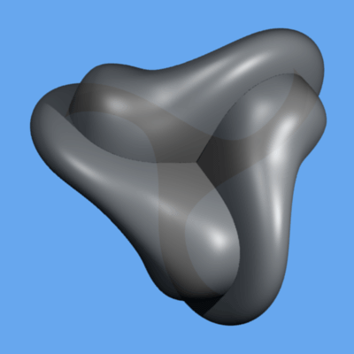
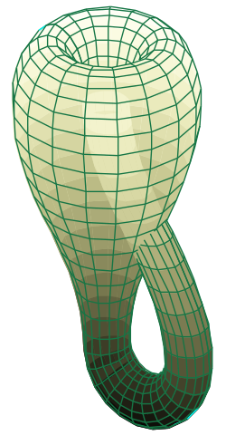
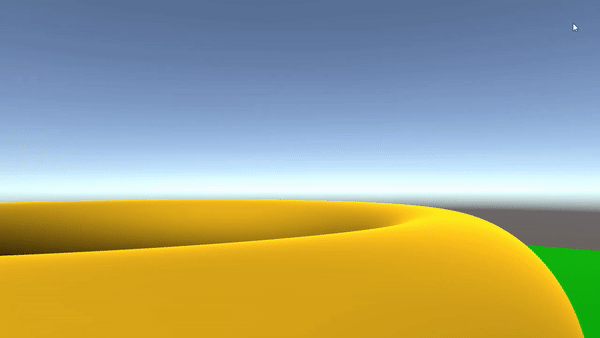
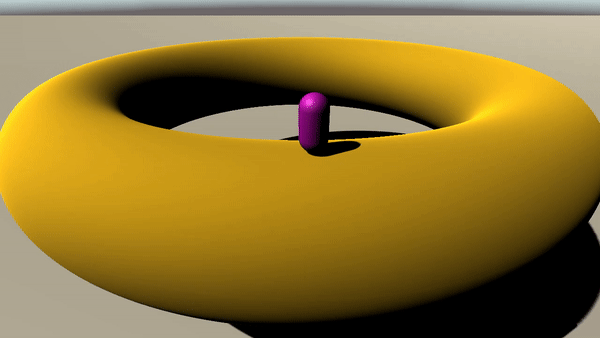
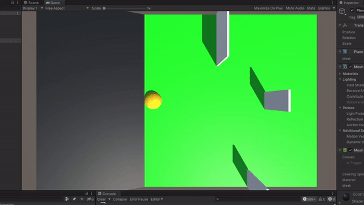

# Non-Euclidean-Game
We built a game with non-euclidean objects like the klein bottle or the boy's surface.
## Table of Contents

* [Project Description](#project-description)
* [Project Goals](#project-goals)
* [Project Ideas](#project-ideas)
* [Meeting notes 18.12.2020](#meeting-notes-18.12.2020)
* [Technologies](#technologies)
* [TODO](#todo)
* [Project Status](#project-status)
* [Inspiration](#inspiration)
* [Resources](#resources)
* [Contributors](#contributors)

## Project Description

In unserem Projekt arbeiten wir daran die Welt der nicht euklidischen Objekte etwas näher zu beleuchten und nahbar zu machen. Dazu benutzen wir die Kleinsche Flasche und die Boysche Fläche, da diese für unsere Zwecke am besten geeignet sind. Zu Beginn allerdings testen wir unsere Implementierung anhand eines Donuts. 
Die Spielidee dahinter basiert darauf, dass der Spieler in eine Welt geworfen wird und nur durch herumgehen herausfinden muss, auf welcher Art von Welt er sich befindet. Eine weitere Idee wäre, das wir eine Art Hide & Seek Mechanik einbauen, bei der sich der Spieler vor Wachen verstecken muss, die ihn suchen. 

Boysche Fläche             |  Kleinsche Flasche
:-------------------------:|:-------------------------:
  |  

## Project Goals
* Eine nichteuklidische Fläche bauen auf der man als Spielfigur herumlaufen kann und Wachen ausweichen muss. Fläche besteht aus kleinsche Flasche, Boysche Fläche, Möbiusband
* Zwischenstufe: Wie in Mario Galaxy
* Fortführung: Welt verändert sich und faltet sich während des Spiels zu einer anderen Form
* Fortführung II: Auf der Welt gibt es Räume, Tunnel etc. die sich wie in dem Video verhalten

## Project Ideas
* Add a gun

## Meeting notes 18.12.2020
* Kleinsche Flasche und Boysche Fläche besser geeignet, da sie  keinen Rand haben
* was passiert mit dem Spieler, wenn er in der Kleinschen Flasche an den Schnittpunkt kommt?
* Sonnensystem Idee: Spieler weiß nicht auf welcher Fläche er sich befindet und muss das rausfinden
* Jede Ausbaustufe eigenes Anfängerpraktikum
* Thorus statt Möbiusband
* Meshlab Programm (.ply, .obj)
* Binary spaced partition für Portale
* Kleinsche Flasche durch Portal gehen und dann einfach links und rechts vertauschen
* Mesh suchen für eine der Flächen
* Pymarid of Ra
* Irgendwo eine Markierung setzten für außern oder innen für Weltveränderung
* Meshgenerator
* Ziel ist Umgang mit Werkzeugen und Spiel zu haben

## Technologies 
* Unity Version 2019.4.4f1

## TODO
* Alles.

## Project Status
### 16.02.2021
Grundmechanik der laufens auf dem Mesh eines Donuts ist implementiert. Allerdings gibt es noch ein paar Fehler, da man teilweise unter das Mesh laufen kann. Als nächster Schritt wird versucht eine bessere Steuerung zu implementieren.

- - - - -

### 17.02.2021
- GitHub README geupdated
- Steuerungsmechanik für Kamera und Spieler implementiert. Er kann sich in alle Richtungen umschauen und seine Bewegungsrichtung ist abhängig von der Richtung in die die Kamera schaut. Allerdings gibt es noch ein paar unschöne Fehler...

- - - - - 

### 03.03.2021
- Tried to figure out the problem with raycast, found out that somehow the GroundDetector forgets what it should detect

## Inspiration

* [Antichamber](http://www.antichamber-game.com)
* [Hyperbolica](https://store.steampowered.com/app/1256230/Hyperbolica/)

## Resources

* [Mesh Deformation](https://catlikecoding.com/unity/tutorials/mesh-deformation/)
* [Bend 3d object (Mesh) at Runtime](https://answers.unity.com/questions/1725691/bend-3d-object-mesh-at-runtime.html)
* [How to make plane look curved?](https://answers.unity.com/questions/288835/how-to-make-plane-look-curved.html?childToView=288888#answer-288888)
* [Non-Euclidean Geometry](https://www.reddit.com/r/Unity3D/comments/3qqyic/noneuclidean_geometry/)
* [Impossible non euclidean geometry](https://forum.unity.com/threads/impossible-non-euclidean-geometry.893938/)
* [Coding Adventure: Portals](https://www.youtube.com/watch?v=cWpFZbjtSQg)
* [Portal Rendering with Offscreen Render Targets](https://tomhulton.blogspot.com/2015/08/portal-rendering-with-offscreen-render.html)
* [The Perspective and Orthographic Projection Matrix](https://www.scratchapixel.com/lessons/3d-basic-rendering/perspective-and-orthographic-projection-matrix/projection-matrices-what-you-need-to-know-first)
* [A Solution To Unity's Camera.WorldToScreenPoint Causing UI Elements To Display When Object Is Behind The Camera](https://www.turiyaware.com/blog/a-solution-to-unitys-camera-worldtoscreenpoint-causing-ui-elements-to-display-when-object-is-behind-the-camera)
* [Impossible Geometry: Non-Euclidean Cubes](https://www.alanzucconi.com/2015/12/09/3873/)
* [True Non-Euclidean Space](https://answers.unity.com/questions/1085798/true-non-euclidean-space.html)
* [Möbius effect in Unity](https://gamedev.stackexchange.com/questions/178711/möbius-effect-in-unity)
* [Möbius Transformations Revealed [HD]](https://www.youtube.com/watch?v=0z1fIsUNhO4)
* [Möbius Transformations Revealed](https://www-users.math.umn.edu/~arnold//moebius/)
* [3D-Moebius-Transformations-Vertex-shader-in-Unity-3D](https://github.com/IRCSS/3D-Moebius-Transformations-Vertex-shader-in-Unity-3D)
* [Rendering Hyperbolic Spaces - Hyperbolica Devlog #3](https://www.youtube.com/watch?v=pXWRYpdYc7Q)
* [4-Dimensional Rotations](https://spacesymmetrystructure.wordpress.com/2008/12/11/4-dimensional-rotations/)
* [Moebius transformations in 3d](https://gist.githubusercontent.com/Dan-Piker/f7d790b3967d41bff8b0291f4cf7bd9e/raw/6225dadae2d8960fbc523b0082ae411e860803ad/Moebius3d)
* [Dan-Piker](https://github.com/Dan-Piker)
* [Palace of the Counts of Barcelos](https://sketchfab.com/3d-models/palace-of-the-counts-of-barcelos-655707837d0a4c4d814eb203f2a95bbc)
* [Psuedo-Non-euclidean geometry in Unity [A response video of sorts]](https://www.youtube.com/watch?v=ukdIAcfGKF4)
* [[Unity] First Person Controller [E01: Basic Controller]](https://www.youtube.com/watch?v=PmIPqGqp8UY)

## Contributors

* Paavo Streibich, kf223@uni-heidelberg.de

* Jan Straub, jan.straub@stud.uni-heidelberg.de